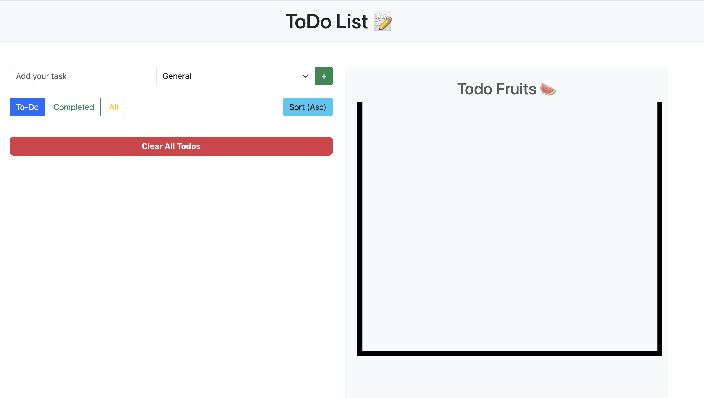
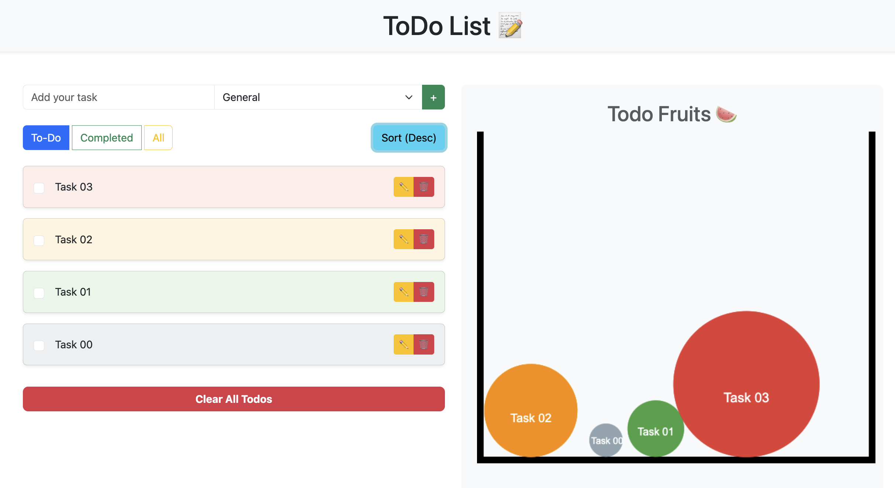
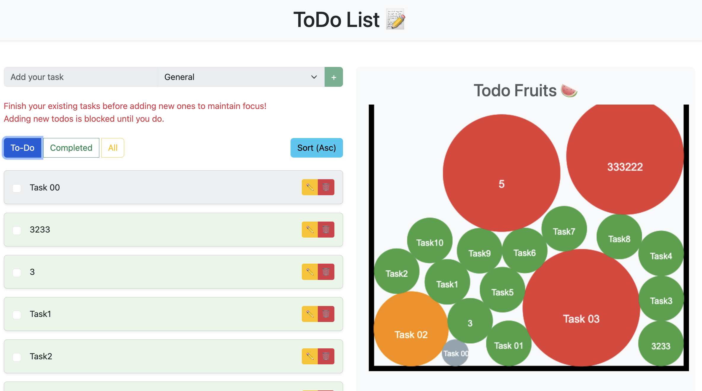

# FruitTodo 앱 🍉

FruitTodo는 Vue 3로 만든 시각적으로 재미있고 인터랙티브한 할 일 목록 앱입니다. 이 앱은 Matter.js 물리 엔진을 사용한 과일 테마의 시각화를 통해 할 일 관리와 재미를 결합하였습니다. 각 할 일은 과일로 표현되며, 중요도에 따라 크기와 색상이 다르게 설정됩니다. 생산성을 높이면서도 즐겁게 사용할 수 있도록 설계되었습니다.

---

## 주요 기능 ✨

### 할 일 관리
- **할 일 추가**: 중요도를 설정하여 쉽게 할 일을 추가할 수 있습니다.
- **할 일 수정**: 할 일의 내용을 수정하거나 중요도를 변경할 수 있습니다.
- **완료 표시**: 할 일을 완료 또는 미완료 상태로 전환할 수 있습니다.
- **필터링**: 할 일의 상태별로 (`미완료`, `완료`, `모두`) 필터링해서 볼 수 있습니다.
- **정렬**: 중요도에 따라 할 일을 (`오름차순`, `내림차순`) 정렬할 수 있습니다.
- **할 일 삭제**: 미완료된 모든 할 일을 한 번에 삭제할 수 있습니다.

### 시각화
- **과일로 표현**: 할 일이 바구니 안의 과일로 시각화됩니다.
  - 할 일의 중요도에 따라 과일의 크기와 색상이 결정됩니다.
  - 과일은 중력과 충돌 효과를 사용해 바구니 안에서 움직입니다.
- **경고 메시지**: 과일의 총 면적이 바구니의 60%를 초과하면 새로운 할 일을 추가할 수 없습니다.

### 데이터 저장
- Pinia의 영구 상태 기능을 사용해 로컬에 할 일을 저장합니다.

---

## 프로젝트 구조 🐂

```plaintext
├── public/
│   ├── favicon.ico
├── src/
│   ├── assets/
│   │   ├── global.css  # 글로벌 스타일
│   ├── components/
│   │   ├── Fruit.vue       # Matter.js를 사용한 과일 시각화
│   │   ├── TodoInput.vue   # 할 일 추가 입력 필드
│   │   ├── TodoItem.vue    # 개별 할 일 컴포넌트
│   ├── constants/
│   │   ├── fruits.js       # 중요도에 따른 과일 속성
│   ├── router/
│   │   ├── index.js        # 네비게이션 설정 라우터
│   ├── stores/
│   │   ├── todoStore.js    # 할 일 관리 Pinia 저장소
│   ├── views/
│   │   ├── TodoListView.vue  # 주요 할 일 관리 페이지
│   ├── App.vue             # 루트 컴포넌트
│   ├── main.js             # 앱 진입점
├── index.html              # HTML 템플릿
├── vite.config.js          # Vite 설정 파일
```

---

## 데모 & 스크린샷 📸

### 데모 영상


### 애플리케이션 기본 화면
 

### 할 일의 중요도별 과일 크기 차이
 

### 할 일이 너무 많을 시 할 일 추가 버튼 비활성화


---

## 설치 방법 🚧

### 사전 준비
- Node.js (v16 이상)
- npm 또는 yarn

### 설치 단계
1. 리포지토리 클론:
   ```bash
   git clone https://github.com/your-username/fruit-todo-app.git
   cd fruit-todo-app
   ```

2. 의존성 설치:
   ```bash
   npm install
   ```

3. 개발 서버 시작:
   ```bash
   npm run dev
   ```

4. 브라우저에서 앱 열기:
   ```
   http://localhost:5173
   ```

---

## 사용 기술 🧭

- **프론트엔드**: Vue 3 (Composition API, `<script setup>`), Pinia
- **스타일링**: Bootstrap 5, Scoped CSS
- **물리 엔진**: Matter.js
- **빌드 도구**: Vite

---

## 개선 사항 및 로드맵 🚀

### 리팩토링
- `Fruit.vue`와 `TodoListView.vue` 컴포넌트를 모듈화하여 유지보수성과 가독성을 향상시킵니다.
- `Fruit.vue`의 Matter.js 관련 로직을 composable 함수나 유틸리티 파일로 분리합니다.
- `TodoListView.vue`의 계산된 속성을 최적화해 성능을 개선합니다.

### 추가 기능
- 할일의 기한 추가/수정/삭제 기능 추가
- 기한이 지난 할 일에 대한 알림/푸시 기능 추가.
- 할일의 카테고리화 기능 추가
- 과일 시각화 및 시뮬레이션 엔진 업그레이드

---

## 라이선스 📝

이 프로젝트는 [MIT 라이선스](./LICENSE) 하에 제공됩니다.

---

## 기여 방법 🤝

기여는 언제나 환영입니다! 이슈를 생성하거나 풀 리퀘스트를 제출해주세요.

1. 프로젝트를 포크합니다.
2. 기능 브랜치를 생성합니다: `git checkout -b feature/new-feature`.
3. 변경 사항을 커밋합니다: `git commit -m '새 기능 추가'`.
4. 브랜치에 푸시합니다: `git push origin feature/new-feature`.
5. 풀 리퀘스트를 엽니다.

---

과일과 함께 즐겁게 생산성을 높여보세요! 🍎🍊🍇

